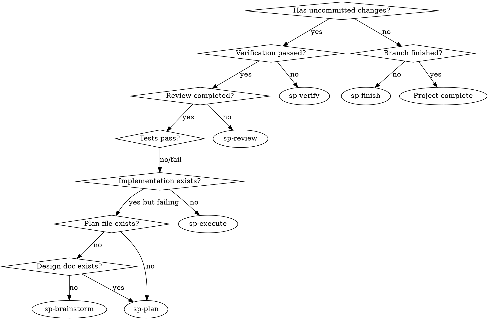

# Superpowers Workflow Guide

## Overview

Home base for the Superpowers Workflow module. Detects your current phase by scanning filesystem artifacts and recommends the next skill.

**Announce at start:** "Using sp-workflow-guide to orient in the superpowers workflow."

## Phase Detection Logic

Scan the project in this order. The **first unmatched check** is where you are:



**Simplified checks (run in order):**

1. **No git repo?** → You need a project first. Suggest `git init` or open an existing project.
2. **No design doc AND no plan file?** → Phase: **1-brainstorm** — recommend `[BR] sp-brainstorm`
3. **Design doc exists but no plan file?** → Phase: **2-plan** — recommend `[PL] sp-plan`
4. **Plan file exists but no implementation?** → Phase: **3-execute** — recommend `[EX] sp-execute`
5. **Implementation exists but no review?** → Phase: **4-review** — recommend `[RV] sp-review`
6. **Review done but not verified?** → Phase: **5-verify** — recommend `[VF] sp-verify`
7. **Verified but branch not finished?** → Phase: **6-finish** — recommend `[FN] sp-finish`
8. **All complete?** → Project shipped. Offer to start a new cycle with `[BR] sp-brainstorm`.

### Artifact Detection Rules

| Artifact | How to Detect | Indicates |
|----------|---------------|-----------|
| Design doc | `docs/superpowers/plans/*-design.md` or `*-brainstorm*.md` | Brainstorm completed |
| Plan file | `docs/superpowers/plans/*.md` containing task checkboxes | Plan written |
| Implementation | Source files modified (check `git diff --stat` against plan) | Execution in progress |
| Review | PR comments exist or review feedback documented | Review requested/received |
| Verification | Plan checklist all checked AND test run passes | Verification done |
| Branch finished | Clean working tree, PR merged or branch deleted | Complete |

## Anytime Skills Available

These can be used at any phase:

- `[TD] sp-tdd` — Quick TDD cycle for small features
- `[DB] sp-debugging` — Systematic debugging when bugs arise
- `[WT] sp-worktrees` — Git worktree management

## Response Format

Present the orientation as:

```
📍 Superpowers Workflow — Current Phase

Phase: {phase-name}
Status: {what's done} → {what's next}

Recommended: [{code}] {skill-name}
Invoke: /sp-{skill-name}

{Brief explanation of why this is the next step}
```

## Workflow Quick Reference

```
[BR] sp-brainstorm → [PL] sp-plan → [EX] sp-execute → [RV] sp-review → [VF] sp-verify → [FN] sp-finish
                      ↗ required      ↗ required       ↗ required        ↗ required
```

Anytime: `[WG] guide` | `[TD] tdd` | `[DB] debugging` | `[WT] worktrees`
